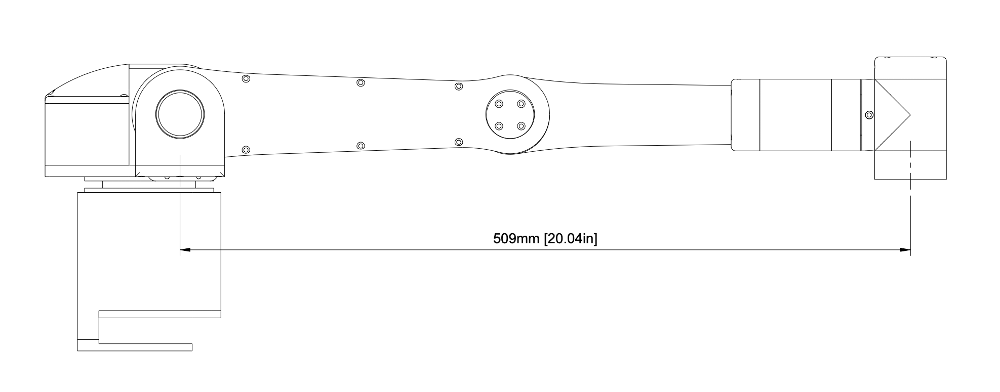

# Zippy - A 6 DOF Robot Arm

## Overview

Zippy is an open-source low-cost 3D printed robotic arm with 6 revolute joints. It is a compact lightweight desktop robot arm that makes it ideal for table-top tasks. It is especially useful for individuals that may not have access to expensive fabrication machines such as CNC machines or waterjet cutters, as it is designed to be fully 3D printed and assembled with minimal tools.

Zippy can be used for tabletop photography and cinematography, with precise control over waypoints, as well as the velocity and acceleration between waypoints. The ease of programming Zippy also makes it a great educational tool to learn about open chain kinematics, including forward, inverse, and velocity kinematics.

Zippy can also be modified for any application by screwing the proper attachment onto the universal end-effector plate, allowing it to perform other desired tasks such as assembly, screwdriving, or pick-and-place.

## Specifications

  

Reach: 509 mm / 20.04 inches

Payload: 500 g / 1.1 lbs

Maximum joint speeds at payload: 360 deg/s

Infinite rotation at end joint

Note maximum payload can be increased with reduced joint speeds
